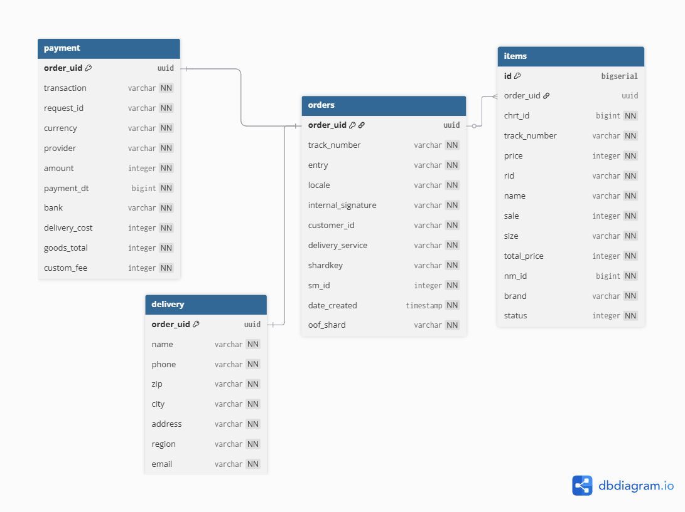
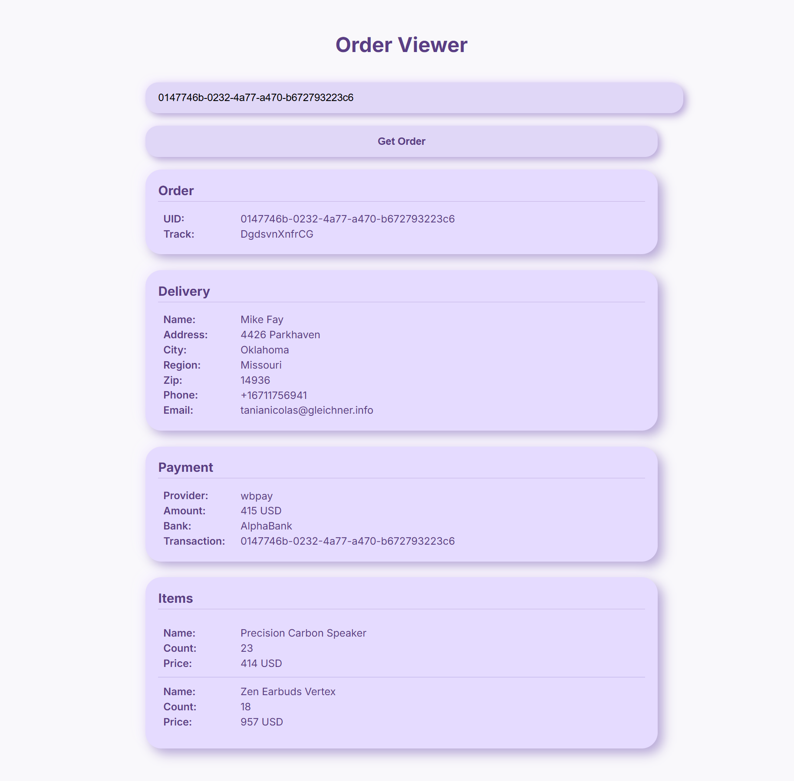

# Демонстрационный сервис с Kafka, PostgreSQL, кешем
Тестовое задание для WB Техношколы (L0).
Проект реализует обработку заказов через Kafka, сохранение данных в PostgreSQL и работу с кешем.

## Инструкция по запуску
1. Клонировать репозиторий:
   ```bash
   git clone https://github.com/sonni-a/wb-service.git
   cd wb-service
2. Создать файл .env на основе env.example
    ```bash
    cp .env.example .env
3. Запустить проект через Docker Compose:
    ```bash
    docker compose up --build
4. После запуска сервис будет доступен по адресу 
    ```arduino
    http://localhost:8081

## Используемые технологии
* Go 1.24.5
* PostgreSQL 16
* Kafka
* Docker Compose 
* HTML
* In-memory кеш с ограничением и удалением элементов при переполнении (map, list.List)
* gomock (mockgen) - для тестирования
* Swagger - документация
* Gofakeit - генерация тестовых данных.

## Схема БД


## Структура проекта
```csharp
wb-service/
├── cmd/
│   ├── main/                
│   │   └── main.go
│   └── producer/       
│       └── producer_main.go
├── internal/
│   ├── config/  
│   │   └── config.go
│   ├── db/  
│   │   ├──migrations/
│   │   │   └── 000001_init_schema.up.sql.go
│   │   └── db.go
│   ├── faker/
│   │   └── faker.go
│   ├── handlers/   
│   │   ├── order_handler.go
│   │   └── order_handler_test.go             
│   ├── kafka/
│   │   ├── consumer.go
│   │   └── producer.go               
│   ├── models/
│   │   ├── models.go 
│   │   └── producer.go  
│   ├── repository/
│   │   ├── erorrs.go 
│   │   ├── order.go 
│   │   ├── queries.go 
│   │   └── mock_repository/
│   │       └── order_mock.go  
│   ├── service/
│   │   ├── cache.go 
│   │   ├── order_service.go 
│   │   ├── order_service_test.go 
│   │   └── mock_service/
│   │       └── mock_order_service.go  
│   ├── shutdown/ 
│   │   └── shutdown.go       
│   └── web/     
│   │   ├── css/
│   │   │    └── style.css 
│   │   ├── js/
│   │   │    └── main.js  
│   │   └── index.html    
├── docs/                    
├── Dockerfile
├── docker-compose.yml
├── .env.example
├── go.mod
├── go.sum
└── README.md
```

## Скриншоты и видео


Ссылка на видео с демонстранцией работы проекта: https://drive.google.com/file/d/17lTH-0MuuTNS8I9d3ViDL5V_zrRqAm_z/view?usp=sharing
