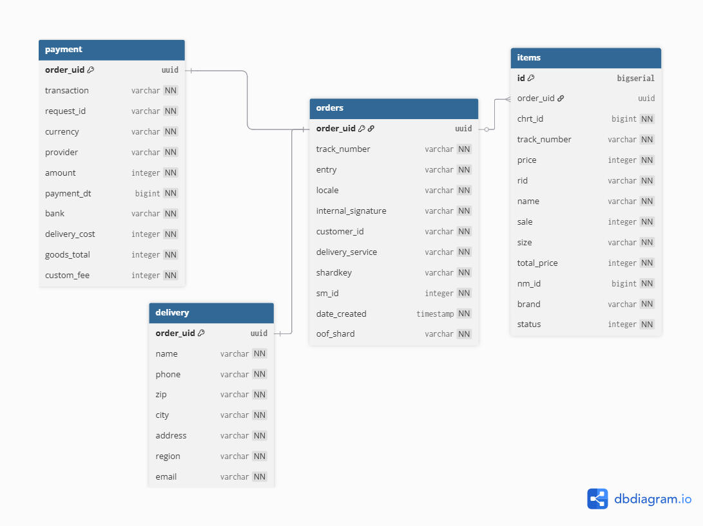
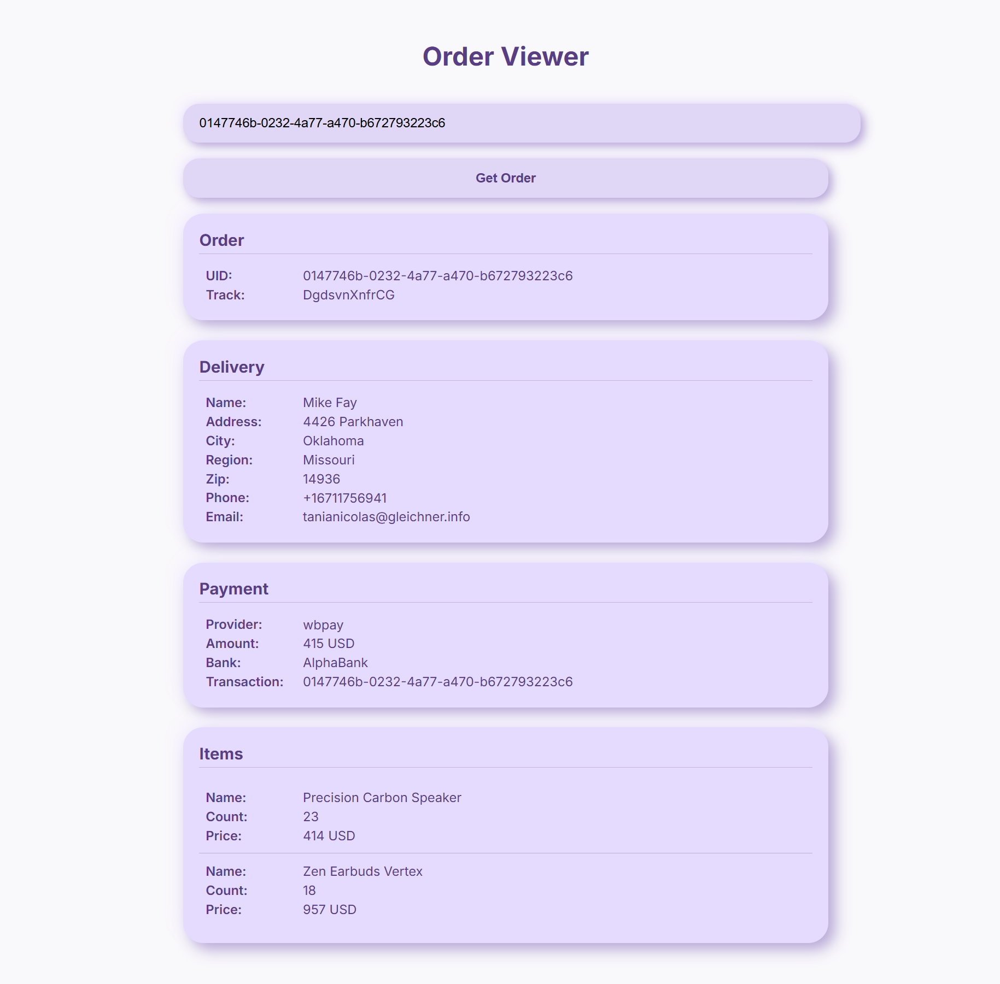

# Демонстрационный сервис с Kafka, PostgreSQL, кешем
Демонстрационный backend-сервис обработки заказов на Go.
Сервис получает события заказов из Apache Kafka, валидирует данные и сохраняет их в PostgreSQL. Для ускорения чтения используется in-memory LRU-кеш с ограничением размера.
Сервис предоставляет HTTP API для получения заказов, поддерживает мониторинг через Prometheus и Grafana, а также включает обработку ошибок Kafka (DLQ), идемпотентность повторных сообщений, unit-тесты и контейнеризацию через Docker.

## Инструкция по запуску
1. Клонировать репозиторий:
   ```bash
   git clone https://github.com/sonni-a/wb-service.git
   cd wb-service
2. Создать файл .env на основе env.example
    ```bash
    cp .env.example .env
3. Запустить проект через Docker Compose:
    ```bash
    docker compose up --build
4. После запуска сервис будет доступен по адресу 
    ```arduino
    http://localhost:8081

## Используемые технологии
### Backend
* Go 1.24
* PostgreSQL 16
* Apache Kafka
### Инфраструктура
* Docker
* Docker Compose 
* golang-migrate
### Тестирование
* gomock (mockgen)
### Линтер
* golangci-lint
### Observability 
* Prometheus
* Grafana
### Документация
* Swagger
### Генерация тестовых данных
* Gofakeit
### Frontend (для демонстрации)
* HTML
* CSS
* JavaScript

## Мониторинг
### Метрики Prometheus
* http_requests_total
* http_request_duration_seconds
* kafka_messages_processed_total
* kafka_processing_errors_total
* kafka_dlq_messages_total
* cache_hits_total
* cache_misses_total
* db_query_duration_seconds
### Дашборд Grafana
* HTTP Error Rate
* DB Query Latency
* Cache Hit Rate
* Kafka Errors
* Kafka Throughput
* HTTP p95 Latency
* HTTP Requests Per Second (RPS)


## Схема БД


## Структура проекта
```csharp
wb-service/
├── cmd/
│   ├── main/                
│   │   └── main.go
│   └── producer/       
│       ├── producer_main.go
│       └── faker.go
├── internal/
│   ├── config/  
│   │   └── config.go
│   ├── db/  
│   │   └── db.go
│   ├── handlers/   
│   │   ├── order_handler.go
│   │   └── order_handler_test.go             
│   ├── kafka/
│   │   ├── consumer.go
│   │   └── producer.go
│   ├── metrics/
│   │   ├── metrics.go 
│   │   └── middleware.go                
│   ├── models/
│   │   └── models.go 
│   ├── repository/
│   │   ├── errors.go 
│   │   ├── order.go 
│   │   ├── queries.go 
│   │   └── mock_repository/
│   │       └── order_mock.go  
│   ├── service/
│   │   ├── errors.go 
│   │   ├── cache.go 
│   │   ├── order_service.go 
│   │   ├── order_service_test.go 
│   │   └── mock_service/
│   │       └── mock_order_service.go  
│   ├── shutdown/ 
│   │   └── shutdown.go
│   ├── validator/
│   │   └── order.go
│   └── web/     
│       ├── static.go
│       ├── css/
│       │    └── style.css 
│       ├── js/
│       │    └── main.js  
│       └── index.html    
├── migrations/
│   ├── 000001_create_orders.up.sql
│   ├── 000001_create_orders.down.sql
│   ├── 000002_create_delivery.up.sql
│   ├── 000002_create_delivery.down.sql
│   ├── 000003_create_payment.up.sql
│   ├── 000003_create_payment.down.sql
│   ├── 000004_create_items.up.sql
│   ├── 000004_create_items.down.sql
│   ├── 000005_create_items_index.up.sql
│   └── 000005_create_items_index.down.sql
├── docs/                    
├── Dockerfile
├── docker-compose.yml
├── .env.example
├── go.mod
├── go.sum
├── golangci.yml
└── README.md
```

## Скриншоты и видео


Ссылка на видео с демонстранцией работы проекта: https://drive.google.com/file/d/17lTH-0MuuTNS8I9d3ViDL5V_zrRqAm_z/view?usp=sharing
